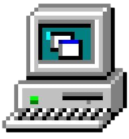
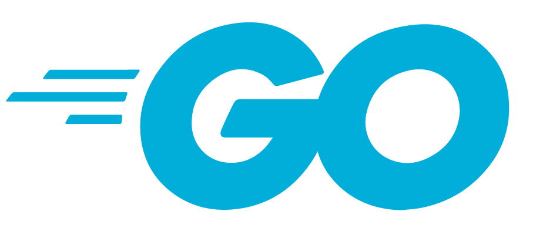
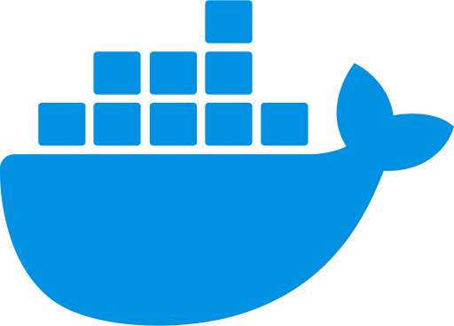

## Hey, I'm Marcus!

 
 

### About Me:

- ☁️ &nbsp; Currently interested in Cloud Development and DevOps, focusing on leveraging cloud services and automation to create scalable and efficient solutions
- 💻 &nbsp; Experienced in Fullstack Development with TypeScript/js and Next.js, building dynamic and responsive web applications
- 🧠 &nbsp; Currently learning Golang for cloud services for backend development

 

### 🔨 Languages and Tools:

 

